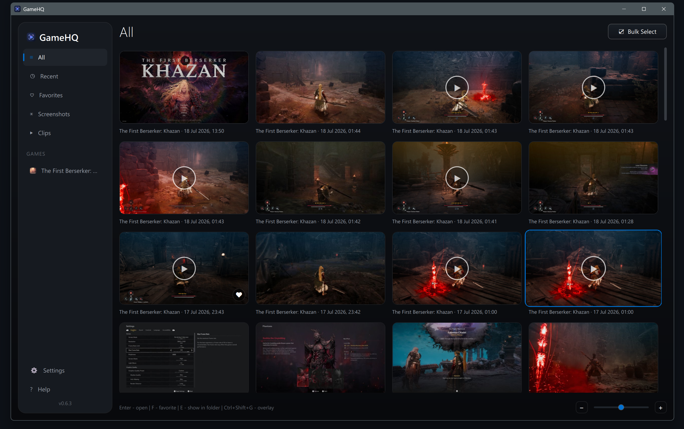

<div align="center">


# GameHQ

**Save the moments that already happened — screenshots, recent-gameplay video clips, and an in-game capture gallery for Windows.**

[](https://github.com/underfusion/GameHQ/releases/latest)
[](#requirements)
[](LICENSE)

</div>



GameHQ brings console-style capture controls to PC gaming. While you play, it
continuously keeps the most recent gameplay in a rolling buffer. When something
worth saving happens, press one button **after the moment** to turn the previous
configurable minutes into a normal MP4 video clip — there is no need to start
recording beforehand. You can also take instant screenshots and browse everything
in a controller-friendly gallery without leaving your game.

## Highlights

- **Instant screenshots** in PNG or JPEG, organized automatically by game.
- **Record recent gameplay after it happens**: GameHQ continuously buffers the
  previous configurable minutes, then saves them as an MP4 video with system
  audio when you press the replay button. Duration, quality, frame rate, and
  resolution are configurable.
- **In-game overlay** for browsing, playing, favoriting, revealing, and deleting
  captures without alt-tabbing.
- **Controller-first controls** with DualSense, XInput, WinMM, keyboard, and safe
  extra mouse-button support.
- **Fully configurable bindings** with primary/secondary slots, tap, hold,
  double-tap, conflict handling, per-controller profiles, and restore controls.
- **Unified library** for GameHQ captures plus read-only watched folders from
  tools such as Steam, Xbox Game Bar, NVIDIA, and OBS.
- **Portable and private**: no account, telemetry, game-process injection, or
  background service. Settings and captures can stay beside the app.

## Download

Download `GameHQ-0.5.55-win64.zip` from the
[latest release](https://github.com/underfusion/GameHQ/releases/latest), extract
it anywhere writable, and run `GameHQ.exe`.

The first release is not code-signed, so Windows SmartScreen may ask for
confirmation. Verify that the download comes from this repository's Releases
page before choosing **More info → Run anyway**.

## Default controls

| Input | Action |
|---|---|
| Share / Capture — tap | Take a screenshot |
| Share / Capture — hold | Save the replay buffer as a clip |
| PS / Guide | Open or close the in-game overlay |
| D-pad / left stick | Navigate |
| Cross / south button | Confirm or open |
| Circle / east button | Back |
| `Ctrl+Shift+S` | Take a screenshot |
| `Ctrl+Shift+E` | Save a replay clip |
| `Ctrl+Shift+R` | Toggle the replay buffer |
| `Ctrl+Shift+G` | Toggle the overlay |

Bindings and gesture timing can be changed from **Settings → Input**.

## Requirements

- Windows 10 version 1903 or newer, 64-bit.
- A GPU and driver supporting Windows Graphics Capture and H.264 encoding.
- Enough free disk space for the configured rolling buffer and saved captures.

## Building from source

GameHQ uses C++20, Qt 6.8.3/QML, CMake, Ninja, SQLite, Windows Graphics Capture,
Media Foundation, WASAPI, and Windows input APIs.

See [Development Setup](docs/dev-setup.md) for the toolchain and
[Packaging & Distribution](docs/packaging.md) for the portable package layout.

```powershell
tools/cmake/bin/cmake.exe -S . -B out -G Ninja
tools/cmake/bin/cmake.exe --build out
powershell -ExecutionPolicy Bypass -File packaging/make-dist.ps1
```

## Documentation

Architecture and subsystem documentation lives in [docs/](docs/README.md).
Changes are summarized in the [changelog](CHANGELOG.md).

## License

GameHQ source code is available under the [MIT License](LICENSE). Distributed
packages also contain Qt, FFmpeg, and compiler runtime components under their
respective licenses; see [Third-Party Notices](THIRD_PARTY_NOTICES.md).

GameHQ is an independent project and is not affiliated with or endorsed by
Sony Interactive Entertainment, Microsoft, Valve, NVIDIA, or OBS Project.
