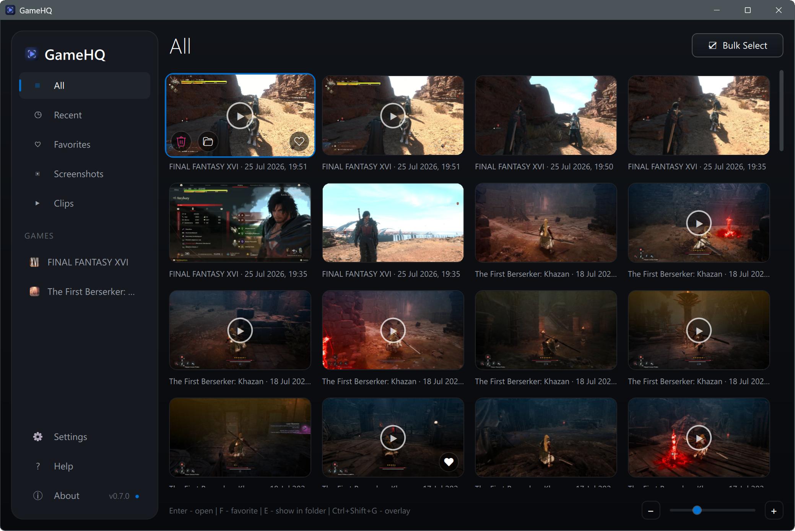

<div align="center">

<p></p>

<p></p>

**Save screenshots and recent gameplay with controller-first controls.**

<!-- public-downloads:start -->
<p align="center">
  <a href="https://github.com/underfusion/GameHQ/releases/download/v0.7.0/GameHQ-0.7.0-win64-setup.exe"></a>
  &nbsp;
  <a href="https://github.com/underfusion/GameHQ/releases/download/v0.7.0/GameHQ-0.7.0-win64-portable.zip"></a>
</p>
<p align="center"><sub>Windows 10+ &middot; MIT licensed &middot; No telemetry</sub></p>
<p align="center"><sub>Using Playnite? <a href="https://github.com/underfusion/GameHQ/releases/download/v0.7.0/GameHQ_Playnite_Integration_0_4_12.pext">Get the GameHQ Integration &rarr;</a></sub></p>
<!-- public-downloads:end -->

</div>



GameHQ brings console-style capture controls to PC gaming. While you play, it
continuously keeps the most recent gameplay in a rolling buffer. When something
worth saving happens, press one button **after the moment** to turn the previous
configurable minutes into a normal MP4 video clip — there is no need to start
recording beforehand. You can also take instant screenshots and browse everything
in a controller-friendly gallery without leaving your game.

## Highlights

- **Instant screenshots** in PNG or JPEG, organized automatically by game.
- **Record recent gameplay after it happens**: GameHQ continuously buffers the
  previous configurable minutes, then saves them as an MP4 video with system
  audio when you press the replay button. Duration, quality, frame rate, and
  resolution are configurable.
- **In-game overlay** for browsing, playing, favoriting, revealing, and deleting
  captures without alt-tabbing. It refreshes immediately after a new capture and
  closes cleanly when Windows focus moves to another app, Start, or the task switcher.
- **Save a frame from any clip**: while a recorded clip is focused, press Share
  or `S` to turn the exact displayed frame into a normal screenshot assigned to
  the same game.
- **Controller-first controls** with DualSense, XInput, WinMM, keyboard, and safe
  extra mouse-button support. Settings can detect Sony controllers hidden by
  HidHide and safely add GameHQ to its application allow-list.
- **Fully configurable bindings** with primary/secondary slots, tap, hold,
  double-tap, conflict handling, per-controller profiles, and restore controls.
- **Thirteen themes**, with Obsidian as the fresh-install default, live theme
  switching, textured backdrops, and adjustable in-game overlay dimming.
- **Controller-friendly library tools** including thumbnail zoom on L2/R2 and
  bulk selection by holding Cross or opening the capture action menu.
- **Unified library** for GameHQ captures plus read-only watched folders from
  tools such as Steam, Xbox Game Bar, NVIDIA, and OBS.
- **Portable and private**: no account, telemetry, game-process injection, or
  background service. Settings and captures can stay beside the app.

## Download

Download GameHQ 0.7.0 from the official
[latest release](https://github.com/underfusion/GameHQ/releases/latest). Choose
`GameHQ-<version>-win64-setup.exe` for the recommended per-user installation, or
the `-portable.zip` package to keep data beside the app.

### Playnite integration

[Manually install GameHQ Playnite Integration 0.4.12](https://github.com/underfusion/GameHQ/releases/download/v0.7.0/GameHQ_Playnite_Integration_0_4_12.pext)
by opening the `.pext` with Playnite. The plugin discovers
GameHQ, launches it with games, forwards game lifecycle events, and restores
state after reconnects. Once the integration is accepted into Playnite's
official add-on database, this section will link to its stable add-on page and
Playnite will surface future updates automatically.

**Open-source Beta · Not yet code-signed; Windows may show an Unknown publisher
warning.** Verify the official source and published release hash before running
an artifact. A specific Defender malware/PUA detection is different: do not
bypass it or disable Windows security. See
[Download verification](docs/download-verification.md) and
[Security & privacy](docs/security-and-privacy.md).

### Portable, installed, and uninstall behavior

Portable keeps its profile and default captures beside the extracted app.
Installed mode uses the current user's AppData and `Videos\GameHQ`. On a fresh,
empty installed profile, **Settings > Advanced > Portable profile** can import
an existing portable configuration and library. The transactional importer
rebases portable paths but leaves the portable source and all capture media in
place; populated installed libraries are never merged in version one.

Uninstall removes only installed program files, shortcuts, and registry values
still owned by that installation. It does not remove AppData, captures, watched
folders, portable copies, or media, and it does not change the license rights
already granted for any downloaded release.

## Code signing policy

GameHQ's [Code signing policy](docs/code-signing-policy.md) defines release
roles, MFA, privacy, signed-file scope, manual approval and verification. The
planned open-source signing attribution is: **Free code signing provided by
SignPath.io, certificate by SignPath Foundation.** It applies to distributed
binaries only after SignPath Foundation accepts the project and the verified
workflow is active; current Beta downloads remain unsigned as stated above.

## Default controls

| Input | Action |
|---|---|
| Share / Capture — tap | Take a screenshot |
| Share / Capture — hold | Save the replay buffer as a clip |
| PS / Guide | Open or close the in-game overlay |
| D-pad / left stick | Navigate |
| Cross / south button | Confirm or open |
| Circle / east button | Back |
| L2 / R2 | Decrease or increase gallery thumbnail size |
| Cross / south button — hold | Enter bulk selection in the desktop gallery |
| Share / `S` while playing a clip | Save the displayed video frame as a screenshot |
| `Ctrl+Shift+S` | Take a screenshot |
| `Ctrl+Shift+E` | Save a replay clip |
| `Ctrl+Shift+G` | Toggle the overlay |

Bindings and gesture timing can be changed from **Settings → Input**.

## Requirements

- Windows 10 version 1903 or newer, 64-bit.
- A GPU and driver supporting Windows Graphics Capture and H.264 encoding.
- Enough free disk space for the configured rolling buffer and saved captures.

## Building from source

GameHQ uses C++20, Qt 6.8.3/QML, CMake, Ninja, SQLite, Windows Graphics Capture,
Media Foundation, WASAPI, and Windows input APIs.

See [Development Setup](docs/dev-setup.md) for the toolchain and
[Packaging & Distribution](docs/packaging.md) for the portable package layout.

```powershell
tools/cmake/bin/cmake.exe -S . -B out -G Ninja
tools/cmake/bin/cmake.exe --build out
powershell -ExecutionPolicy Bypass -File packaging/make-dist.ps1
```

## Documentation

Architecture and subsystem documentation lives in [docs/](docs/README.md).
Changes are summarized in the [changelog](CHANGELOG.md).
Vulnerabilities can be reported privately through the repository's enabled
[security advisory form](https://github.com/underfusion/GameHQ/security/advisories/new).

## License

GameHQ source code is available under the [MIT License](LICENSE). See
[Licensing](docs/licensing.md) for the project boundary and
[Third-Party Notices](THIRD_PARTY_NOTICES.md) for redistributed Qt, FFmpeg,
compiler-runtime, and other components under their respective licenses.

GameHQ is an independent project and is not affiliated with or endorsed by
Sony Interactive Entertainment, Microsoft, Valve, NVIDIA, or OBS Project.
